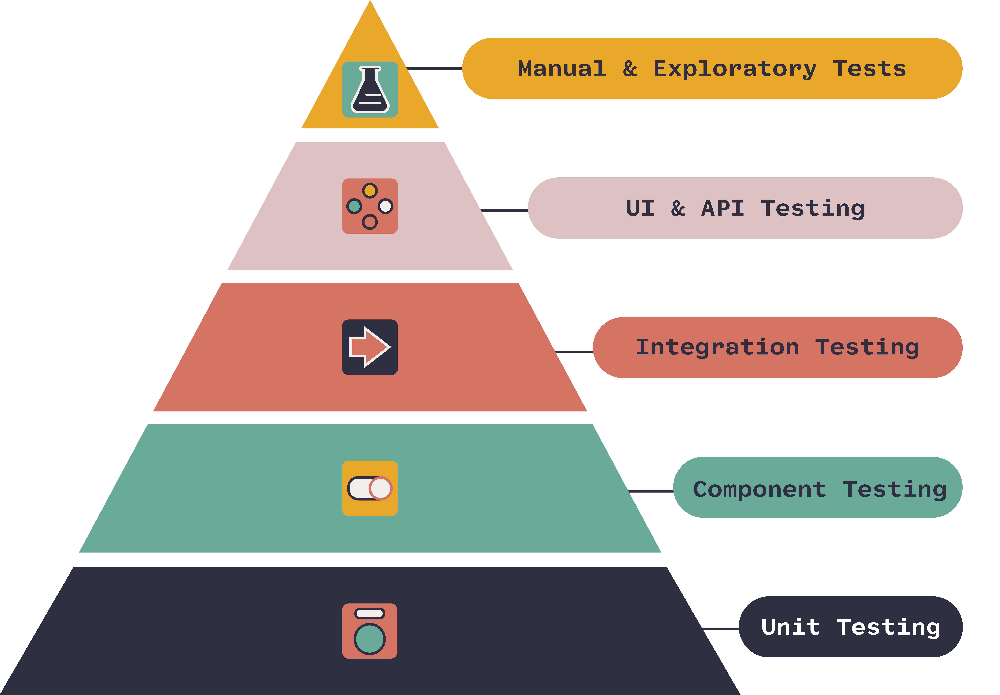
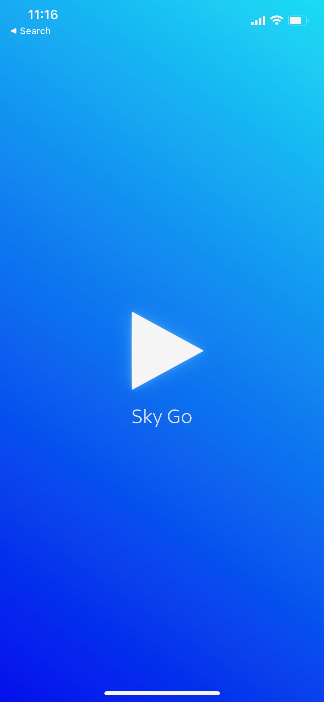
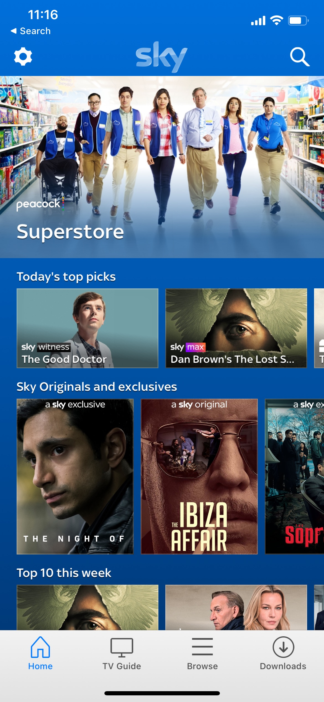
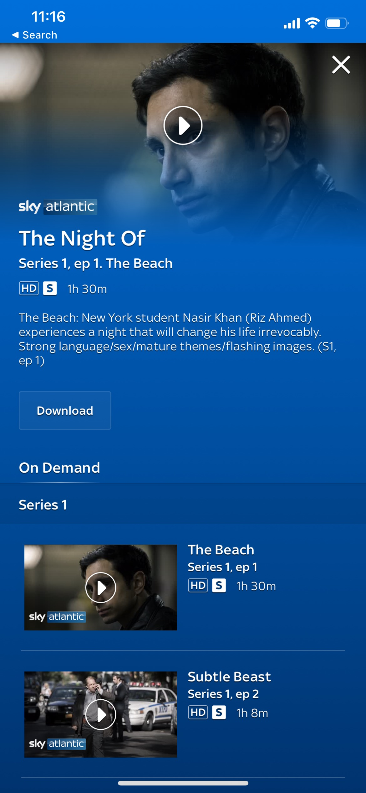
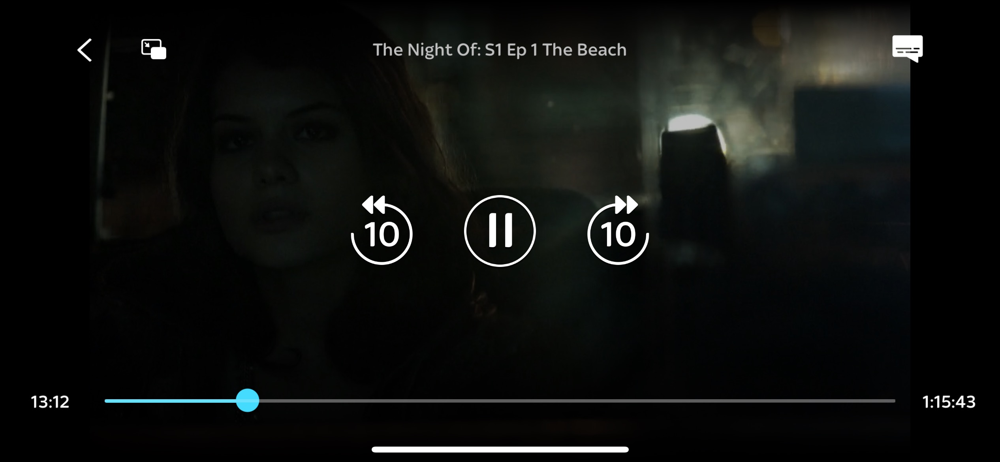
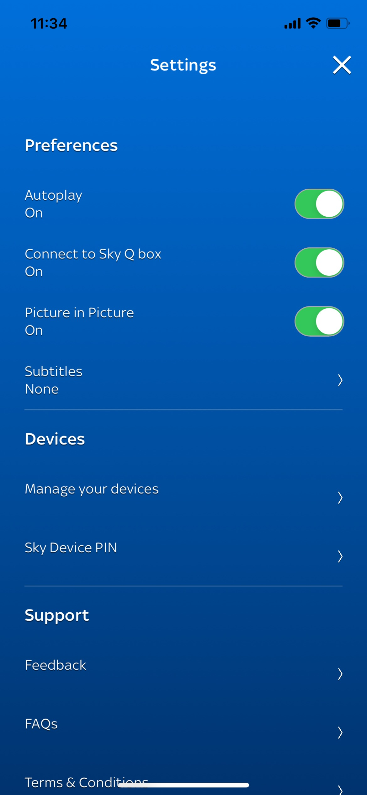

# Mobile Academy 
## Sky Go Training Project 
### App Brief
* Build an OTT VOD browsing and steaming app that uses native DRM protection. 
* Native Android and iOS applications
* Share code via a GraphQL service 
* Target architecure MVVM or MVP 
* Build UI using latest APIs (Swift UI / Jetpack Compose)

## Process 

### Topics to Cover 
* Agile & Scrum
* Sprint Structure & Activities
* Version control and branching process 

### Sprint Structure

* Planning
* Daily Stand Ups 
* Feature Development
* Code Review
* QA
* Merge Feature Code
* Sprint Review Presenation
* Retrospective

### Project Setup & CI
* Xcode / Android Studio / VSCode
* Git / Github 
* Branching strategy
* CI/CD - Jenkins

### Testing

* Unit Testing (XCTest / JUnit)
* UI testing (XCUITest / Espresso)

## Epics and Stories 
### Splash Screen / App Startup 

Build an animated splash screen page which stays displayed until the app has finished carrying out the necessary startup processes before transitioning to the home page. 

* Download the applications config file
* Handle application life cycle events 
* Build a animated splash screen UI

### Home Page

Build a home page UI that presents VOD content to users allowing them to browse content.

* Integration with the QMS endpoint 
* Build a loading spinner / in page error message UI
* Build UI for home page (different rail and cell templates)

### Show Page 

Build a page UI which presents metadata for single and episodic programmes to the user in a modal context.  

* Integrater with the Sky "Ways to Watch API" 
* Present the show page with loading spinner or in page error if the API call fails
* Build the single programme or epesodic content UI for the page

### Login Page

* Integration with the rango API with native UI (if possible)
* Otherwise integrate using SkyID website using a WebView

### Play VOD 

Build a video player which is capable of playing both unencrypted and encrypted Sky VOD assets using Native DRM. (FairPlay, Widevine)

* If user isn’t logged in show login 	
* Initial version can use unencrypted test stream
* Final version can use OVP integration and native DRM (FairPlay, iOS / WideVine, Android) 
* Build the video player UI 
* Local bookmarks bonus feature 

### Settings 

Build a page that displays useful app information and settings to the user in a modal context. 

* Terms and conditions page 
* Player settings 
* Persisting users selections across app sessions using local storage 

### Analytics 

Build a logging system that allows developers and analysts to debug problems as extract useful information about how customers are using the app. 

* Build generic modular logger (or use an off the shelf solution to keep things more simple)
* Log levels 
* Device log 
* Third parties: Firebase, Sentry, Adobe (needs some discussion as we want to keep things simple)
* Crash reporting 

## Docs 

### iOS Links
* Swift Docs: [https://www.swift.org/documentation/](https://www.swift.org/documentation/)
* Swift Tour: [https://docs.swift.org/swift-book/GuidedTour/GuidedTour.html](https://docs.swift.org/swift-book/GuidedTour/GuidedTour.html)
* Swift UI Intro [https://developer.apple.com/tutorials/swiftui](https://developer.apple.com/tutorials/swiftui)
* Human Interface Guidelines: [https://developer.apple.com/design/human-interface-guidelines/ios/overview/themes/](https://developer.apple.com/design/human-interface-guidelines/ios/overview/themes/)

### Android Links
* Kotlin: [https://developer.android.com/kotlin](https://developer.android.com/kotlin)
* Jetpack Compose: [https://developer.android.com/jetpack/compose/tutorial](https://developer.android.com/jetpack/compose/tutorial)
* Android Design Guidelines: [https://developer.android.com/design](https://developer.android.com/design)

### GraphQL Links
* Intro: [https://graphql.org/learn/](https://graphql.org/learn/)
* Using GraphQL: [https://graphql.org/code/](https://graphql.org/code/)
* FAQ: [https://graphql.org/faq/](https://graphql.org/faq/)

### Architecture
* MVVM *(Model, View, View Model)*: [https://en.wikipedia.org/wiki/Model–view–viewmodel](https://en.wikipedia.org/wiki/Model–view–viewmodel)
* MVP *(Model, View, Presenter)*: [https://en.wikipedia.org/wiki/Model–view–presenter](https://en.wikipedia.org/wiki/Model–view–presenter)