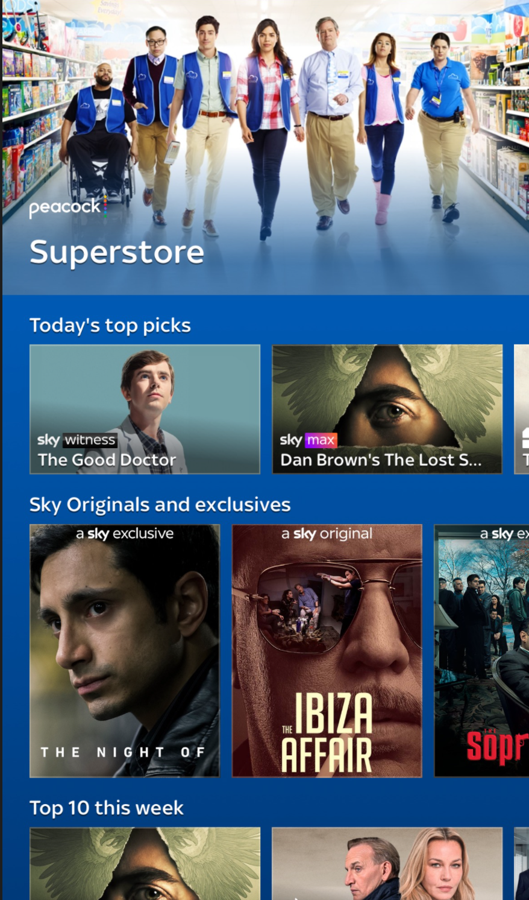
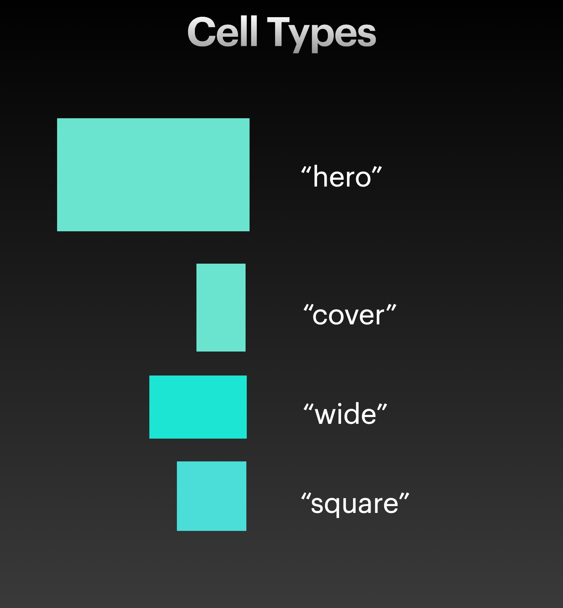
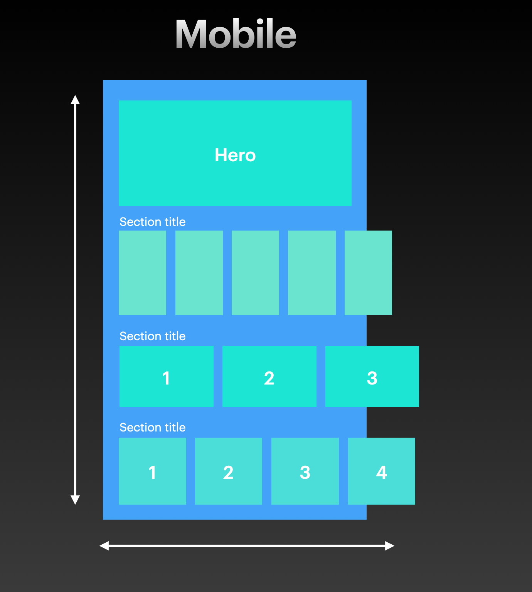
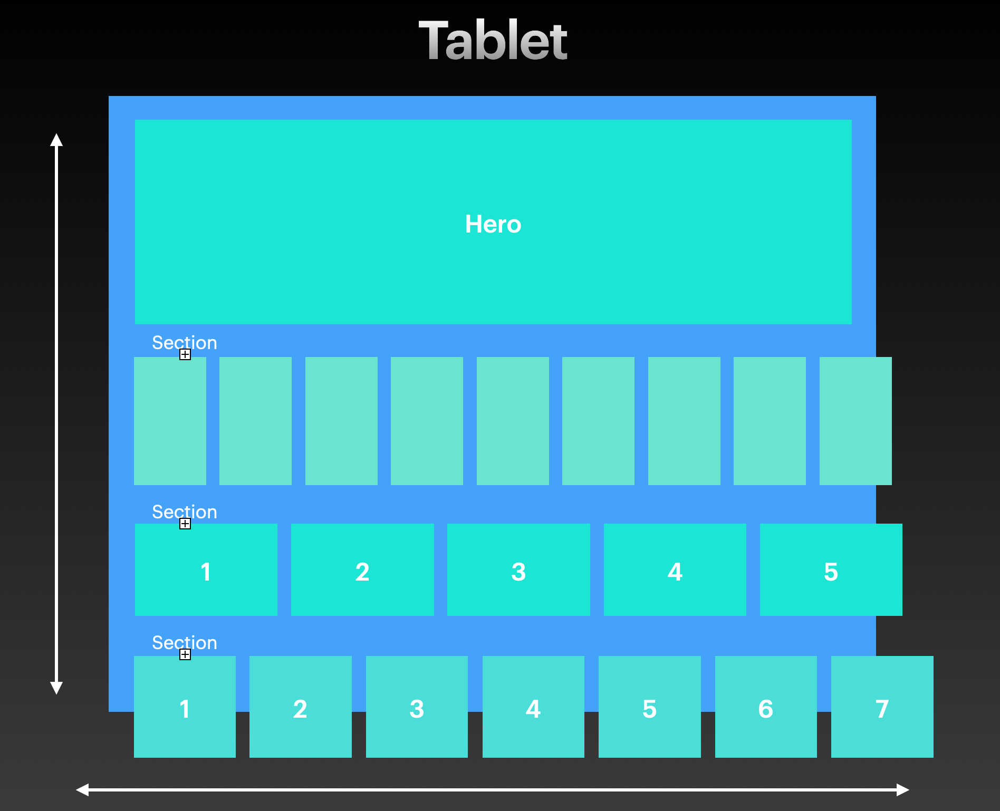
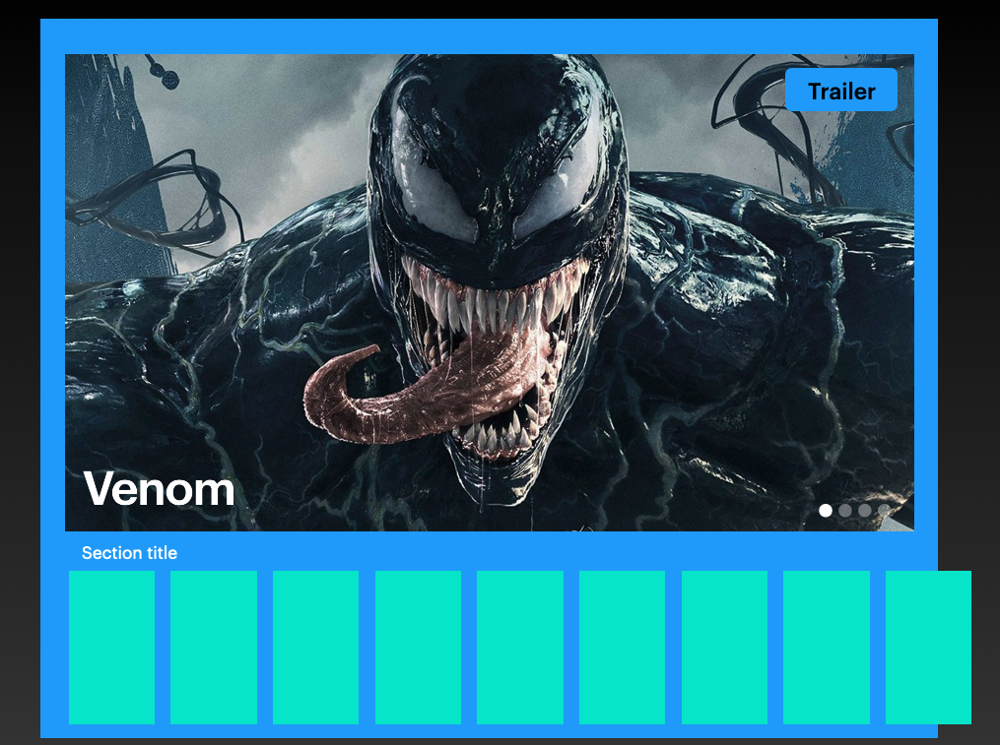

# Homepage Rails UI Exercise

## Brief

Implement a rails based home page UI for your elected mobile platform (Android or iOS) that scales correctly on both tablet and mobile devices. 

The UI should support the following rail template types 
`[hero, wide, cover, square]`

The entire page should be scrollable both vertically and horizontally within each rail component. *Examples in other apps:* _Sky Go, Netflix_ 

## Overview 

1. Make an HTTP GET request to [https://saman-mb.github.io/SkyMobileDeveloperAcademy/exercises/homepage-ui/resources/homepage-ui.json](https://saman-mb.github.io/SkyMobileDeveloperAcademy/exercises/homepage-ui/resources/homepage-ui.json)

2. Parse the data in the response to a Swift struct or Kotlin data class. 

3. Use the parsed object representation of the json as the source of truth for rendering the homepage UI. 

### Hints: 
- _The json file represents the data we want to present in the page and is also structured hierarchically in that it has a 1:1 relationship to the structure of the UI. _

- _dont worry about making the sizes and spaces exact, only try to pick values which approximates the wireframes_

-  _you may notice that some of the properties in the json response are optional, try to think about how to handle the absence of the these values in your code_

- _phones have less screen real estate than tablets so try to think how to build your UI so that we can maximise the space depending on which device were running on. How can we scale down the size of the cells for mobile without changing their aspect ratio?_ 

## UI Wireframes 

## Bonus Exercise 

Upgrade the hero section at the top into an animated movies carousel with images that allows user to play a trailer! 

1. Point your exercise app to the new version of the json file named [https://saman-.github.io/SkyMobileDeveloperAcademy/exercises/homepage-ui/resources/homepage-ui.json](_https://saman-mb.github.io/SkyMobileDeveloperAcademy/exercises/homepage-ui/resources/homepage-ui.json_)

2. You will notice there are some new properties in the hero section. Modify your parsing code in order to account for these new values in the json. 

*__NOTE:__* /_There is now more than one item in the hero sections array and each item has some new properties to consider `image` and `trailer`._/ 

3. Update the UI for the hero rail to a paginated carousel style. When left idol the section should should cycle through the items in the same order defined in the array animating from right to left. When the user swipes left or right section should flick to the item on the left or the right. 

*__NOTE:__* /_The pagination indicator at the bottom right should highlight the relevant item index that’s presented to the user._/

*__NOTE:__* /_The `title` property should be displayed over the image bottom left._/ 

4. Tapping the trailer button should play the trailer. 

*__NOTE:__* /_Use the url provided by the `trailer` property in the json response.  iOS should use `AVPlayer` and Android should user `ExoPlayer`_/ 

### Doc Links
