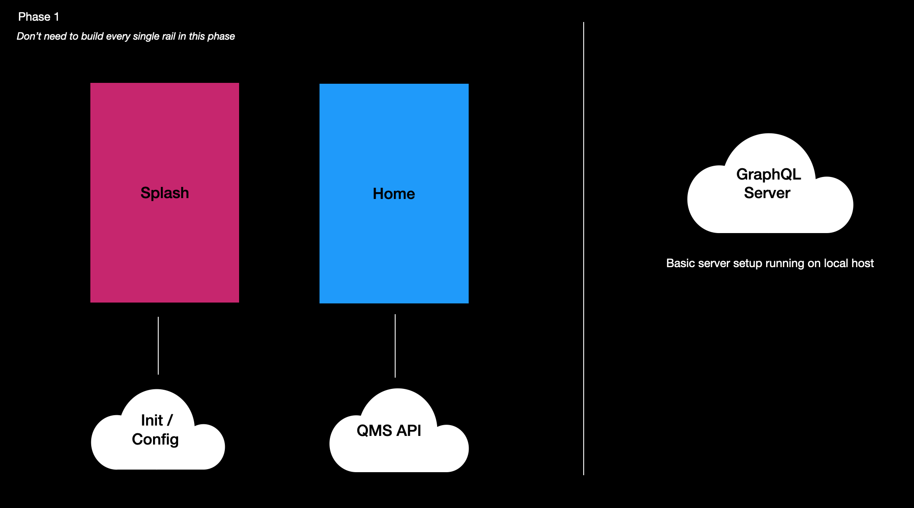

# Project Phases

## Easier Challenges
- splash screen 
- homepage 
- settings
- unencrypted video playback 

## Intermediate Challanges
- showpage
- unit testing 
- GraphQL 
- Logging + Analytics 

## Harder Challenges 
- CI / CD Jenkins - requires some devops support
- UI testing (XCUITest / Espresso)
- Playing encrypted content - OVP / DRM needed for this, we will need to discuss 
- Play encrypted content using Fairplay or Widevine DRM

## Overview 

### Phase 1 

- Project Setup (Xcode / Android Studio)
- Intro to MVVM and unit tests
- Splash screen animated UI + Config request 
- Home screen rails UI + QMS request 
- Build basic GraphQL server in JS get that running 
- basic Jenkins setup that runs the unit tests 
- Agree definition of done for a Pull Request to be merged to `main` 

### Phase 2 

- Un-encrypted video playback - SkyNew live, short-form, free trailers online 
- Learn about the ways to watch search (W2W) API 
- Start discussion with devops to get the GraphQL api deployed in coorp network and CI / CD pipeline to allow devs to deploy updates to the instance easily 
- Update GraphQL server to make both QMS and W2W calls and pass back single model to app 
- Build a showpage for single programmes or series content 
- Integrate homepage and showpage into GraphQL API
- Login journey - after tapping play when logged out 
- Settings - we need to discuss with Ausha which options we need (playback one like subs for instance)

### Phase 3 
- Encrypted video playback - OVP and DRM integration 
- CI / CD jenkins pipeline for app 
- CI - 1 job, app build 
- CI - 2 jobs, run unit tests on mobile and tablet 
- Write a unified logger than outputs to standard log, adobe and firebase 
- Adobe analytics - clicks / views 
- Crash reporting - Firebase 
- Error reporting - Firebase 

